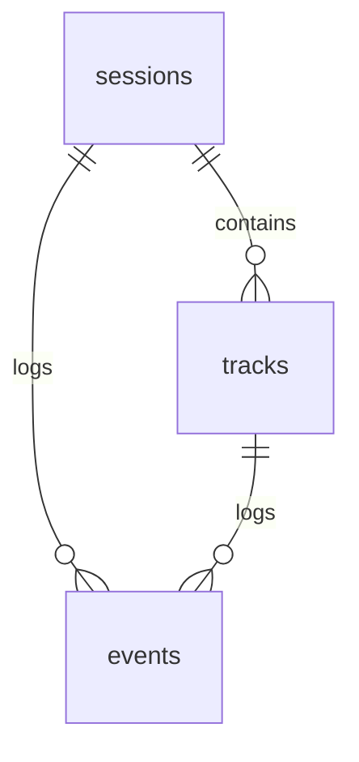
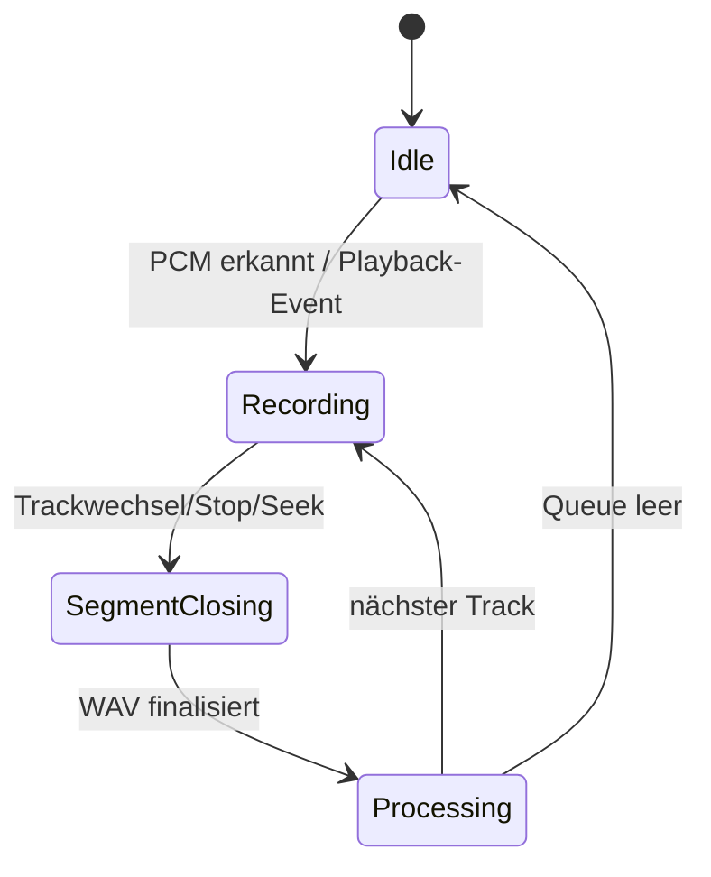
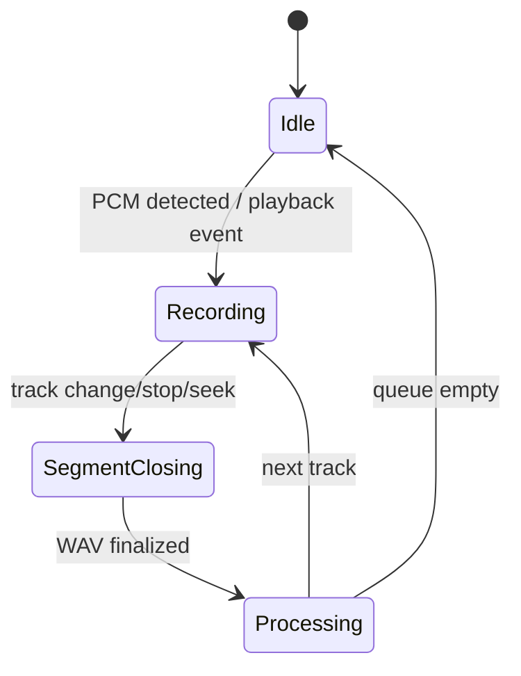

# Tonies Audio Prepper – Technische Spezifikation (Docker, Spotify-Connect, FastAPI)

Diese Spezifikation beschreibt ein zweigeteiltes System zur Aufnahme von Spotify‑Audio via **Spotify Connect** (ohne Desktop‑Loopback), automatischer Aufbereitung für **Kreativ‑Tonies** und einem **Web‑Dashboard** für Status, Historie, Logs und Monitoring. Ziel ist, dass eine externe Person das Projekt direkt umsetzen kann.

---

## Ziele & Nutzen
- **Einfachheit:** „Gerät in Spotify auswählen → abspielen → fertige Tonie‑MP3s erscheinen.“
- **Qualität:** Sprachfreundliche Lautheit & Dynamik, konsistente Ausgabeparameter.
- **Automatik:** Pro Track schneiden, taggen, berichten; Sessions/Ordner ≤ 90 Minuten.
- **Portabilität:** Läuft identisch auf Windows/macOS/Linux/Raspberry Pi via Docker.
- **Observability:** Web‑UI (FastAPI) mit Status, Sessions, Tracks, Live‑Logs, optional Prometheus‑Metrics.

---

## Architektur

### Komponenten
- **connect** (Container): Spotify‑Connect‑Empfänger (librespot). Audioausgabe als **PCM** in eine **FIFO** (Named Pipe). Liefert Playback‑Events (Start/Stop/Seek/Trackwechsel).
- **worker** (Container): Liest PCM von der FIFO, segmentiert pro Track, verarbeitet Audio (ffmpeg), vergibt Metadaten (mutagen), persistiert in **SQLite**, bietet **FastAPI**‑UI+API und **SSE‑Logs**.

### Diagramm (Mermaid)
```mermaid
flowchart LR
  subgraph Host
    subgraph Docker
      A[connect<br/>(librespot)] -- PCM (FIFO) --> B[worker<br/>(FastAPI + Pipeline)]
    end
    B <-- HTTP/SSE --> C[(Browser UI)]
    B <-- Optional OAuth --> D[Spotify Web API]
    B --> E[(SQLite DB)]
    B --> F[(Output Files)]
  end
```

---

## Betriebsablauf (High‑Level)
1. **Start:** `connect` erzeugt ein Spotify‑Connect‑Gerät („Tonie‑Prepper“) und schreibt PCM in `/fifo/spotout`.
2. **Auswahl:** Nutzer wählt das Gerät in der Spotify‑App; Audio fließt in die FIFO.
3. **Segmentierung:** `worker` erkennt Track‑Starts/‑Ends (Events/API) → rohen Track puffern → nach Ende verarbeiten.
4. **Verarbeitung:** Lautheit/Dynamik/Resample/Export, Tags setzen, Dateien/DB/Logs aktualisieren.
5. **Packaging:** Sessions/Ordner ≤ 90 min; optional Auto‑Split in „Tonie #2“ usw.
6. **Dashboard:** Live‑Status, Sessions/Tracks, LUFS/Peaks, Logs, Settings, ZIP‑Download.

---

## Framework‑ & Technologieauswahl
- **Spotify‑Connect:** `librespot` in Docker (Pipe‑Backend, PCM → FIFO).
- **Sprache:** Python 3.12.
- **Web‑Framework:** **FastAPI** (pydantic, OpenAPI).
- **ASGI‑Server:** **uvicorn**.
- **Audio:** **ffmpeg** (Loudnorm, Filter, Codecs).
- **Tagging:** **mutagen**.
- **Datenbank:** **SQLite**.
- **Templating:** **Jinja2**.
- **Live‑Logs:** **Server‑Sent Events (SSE)**.
- **Monitoring:** Optional `/metrics` (Prometheus).
- **Container:** Docker / docker‑compose (2 Services, Named Volume für FIFO).

---

## Konfiguration

### Umgebungsvariablen – `connect` (librespot)
- `NAME` (z. B. `Tonie-Prepper`)
- `BACKEND=pipe`
- `DEVICE=/fifo/spotout`
- `BITRATE=320`
- `VOLUME_NORMALISATION=false`

### Umgebungsvariablen – `worker`
- `TZ=Europe/Berlin`
- **Audio/Preset**
  - `PRESET` = `speech` | `music`
  - `TARGET_LUFS=-18`
  - `TRUE_PEAK=-1.0`
  - `BITRATE_K=96` (speech) / `128` (music)
  - `MONO=1`
  - `MAX_TONIE_MIN=90`
- **UI & Security**
  - `UI_PASSWORD=...` (leer = keine Auth)
  - `ALLOW_ORIGINS=...` (CORS, optional)
- **Spotify API (optional)**
  - `SPOTIFY_CLIENT_ID`, `SPOTIFY_CLIENT_SECRET`, `SPOTIFY_REDIRECT_URI`

### Volumes/Verzeichnisse
- Named Volume `spotpipe` (FIFO‑Austausch).
- Bind‑Mount `./output` → `/app/output` (Ergebnisse).
- Bind‑Mount `./db` → `/app/db` (SQLite).

---

## Dateiausgabe & Namenskonventionen
**Ordnerstruktur:**
```
/output/
  <YYYY-MM-DD>_<AlbumOderSessionName>/
    01_<Titel>.mp3
    02_<Titel>.mp3
    session.json
    session.zip   # optional
```

**ID3‑Tags (Minimal):** `title`, `artist`, `album`, `tracknumber`, optional `comment`, `cover`.

---

## Audio‑Pipeline (Detail)

### Eingänge
- PCM 16‑bit (librespot Pipe), i. d. R. 44.1 kHz, 2 Kanäle.

### Schritte (pro Track)
1. **Puffer/Trim:** Pre‑/Post‑Roll (200–300 ms), Leading/Trailing Stille behandeln.
2. **EQ/De‑Noise (optional):**
   - **Sprache:** Low‑Cut ~90 Hz; Präsenz +1–2 dB (2–5 kHz); sanftes De‑Essing.
   - **Musik:** Neutral; nur DC‑Offset Removal.
3. **Dynamik:** Sanfter Kompressor (ca. Ratio 2:1) für Sprache.
4. **Lautheit:** Zweipass‑Loudness auf `TARGET_LUFS` (−18 LUFS), True‑Peak ≤ −1 dBTP.
5. **Resampling/Channel:** 44.1 kHz, **Mono** (Sprache) / Stereo (Musik).
6. **Export:** MP3 CBR `BITRATE_K` (96/128).
7. **Stillepflege:** Intro 0.3–0.5 s, Outro 1–2 s; interne Stille > 3 s ggf. kürzen.
8. **Validierung:** TP, Dauer, LUFS‑Messwerte speichern.

### Qualitätsziele
- Gleichmäßige Lautheit; kein Clipping (TP ≤ −1 dBTP); klare Sprache auf der Toniebox.

---

## Segmentierungslogik (Track‑Schnitte)
- **Primär:** Playback‑Events/Trackwechsel (librespot) oder Spotify Web API `Currently Playing` (Polling 1–2 s).
- **Fallback:** Stille‑Erkennung (z. B. Pegel < −35 dBFS für ≥ 1.2 s) + Kapitellänge 8–12 min.
- **Schnittpflege:** Pre‑/Post‑Roll; bei Seek neuer Track‑Cut; kurzer Nachlauf (≈500 ms).

---

## Session‑Management (≤ 90 Minuten)
- **Session** = zusammengehörige Aufnahme (z. B. ein Album).
- Summe der Trackdauern überwachen; **ab 90 min neue Session** („Tonie #2“).
- Keine Intratrack‑Splits (außer expliziter Kapitelmodus).

---

## Datenbankmodell (SQLite)



**Tabellen**
- `sessions(id PK, started_at, ended_at, name, artist, preset, total_duration_s, lufs_avg, tonie_index)`
- `tracks(id PK, session_id FK, idx, title, artist, album, duration_s, lufs, true_peak, path, created_at)`
- `events(id PK, ts, level, msg, session_id, track_id)`
- `settings(key PK, value)`
- `auth_tokens(id PK, access_token, refresh_token, expires_at)` *(optional)*

Indizes: sinnvoll auf (`sessions.started_at`), (`tracks.session_id, idx`), (`events.ts`).

---

## HTTP‑API (FastAPI)

### Auth
- Optional **Basic‑Auth** via `UI_PASSWORD`. CORS via `ALLOW_ORIGINS`.

### Endpunkte (Auszug)
- `GET /api/status` → aktueller Zustand & Trackinfos
- `GET /api/sessions` / `GET /api/sessions/{id}`
- `GET /api/tracks?session_id=...`
- `GET /api/logs/stream` (SSE Live‑Logs)
- `POST /api/settings` (Preset/Parameter)
- `GET /api/sessions/{id}/zip`
- `GET /healthz`, `GET /metrics` (optional)
- OAuth optional: `GET /oauth/login`, `GET /oauth/callback`, `DELETE /oauth/logout`

**Beispiel `GET /api/status`**
```json
{
  "state": "idle|recording|processing",
  "current": {
    "title": "string|null",
    "artist": "string|null",
    "album": "string|null",
    "position_ms": 12345,
    "duration_ms": 180000
  },
  "preset": "speech|music",
  "output_dir": "/app/output",
  "active_session_id": 12
}
```

---

## Web‑UI (Dashboard) – **Alle sichtbaren UI‑Elemente auf Deutsch**

### Hauptnavigation
- **Übersicht**, **Sessions**, **Tracks**, **Logs**, **Einstellungen**

### Elemente & Labels
- Jetzt läuft: **Titel**, **Künstler**, **Album**, **Position**, **Dauer**, **Zustand** (Leerlauf/Aufnahme/Verarbeitung), **Preset**
- Buttons: **„ZIP herunterladen“**, **„Ordner öffnen“**, **„Preset wechseln“**
- Tabellen: **„Suche“**, **„Filtern“**, Spalten: **„Nr.“**, **„Titel“**, **„Dauer“**, **„LUFS“**, **„True Peak“**, **„Datei“**
- Einstellungen: **„Ziel‑Lautheit (LUFS)“**, **„True‑Peak‑Limit (dBTP)“**, **„Bitrate (kbps)“**, **„Mono/Stereo“**, **„Passwort setzen“**
- Live‑Logs: Level‑Filter **„Info/Warnung/Fehler“**, **„Logs exportieren“**

---

## Interner Ablauf & Zustandsautomat



**Threads/Queues**
- PCM‑Reader, Event‑Listener, Processor‑Worker (WAV→MP3), SSE‑Dispatcher.

---

## Fehlerfälle & Recovery
- FIFO‑Abriss → Retry alle 5 s; UI‑Warnung.
- Fehlende Events → Fallback Stille‑Detektion.
- ffmpeg‑Fehler → Track überspringen, WAV behalten, Event `ERROR`.
- DB‑Lock → Retry mit Backoff; Auto‑Backup `.bak`.
- Low‑Disk → UI‑Warnung, optional Stopp ab Schwellwert.

---

## Tests & Akzeptanzkriterien
- Unit: Parser/Settings/DB‑CRUD.
- Integration: synthetische PCM‑Feeds + Trackwechsel → Anzahl MP3s, Reihenfolge, Tags, LUFS‑Range.
- E2E: Mini‑Compose + Mock‑Connect; Validation per ffmpeg‑Analyse (Toleranzen).
- Akzeptanz: Album mit 10 Tracks → 10 MP3s, −18 LUFS ±0.5, TP ≤ −1 dBTP, 90‑min‑Policy korrekt.

---

## Deployment & Betrieb
- `docker compose up -d`
- UI: `http://<host>:8080/`
- Restart‑Policy: `unless-stopped`
- Volumes: `spotpipe`, `./output`, `./db`

---

## Roadmap (optional)
- Cover‑Download, Kapitelmodus, Multi‑Instanz, weitere Export‑Profile, Benachrichtigungen.


# Tonies Audio Prepper – Technical Specification (Docker, Spotify Connect, FastAPI) english Version 

This specification defines a two‑container system that captures Spotify audio via **Spotify Connect** (no desktop loopback), automatically prepares it for **Kreativ‑Tonies**, and exposes a **web dashboard** for status, history, logs, and monitoring. It is written in English, **but all end‑user UI labels must be in German**, as listed below.

---

## Goals & Rationale
- **Simplicity:** “Select device in Spotify → play → Tonie‑ready MP3s appear.”
- **Quality:** Speech‑friendly loudness & dynamics, consistent output parameters.
- **Automation:** Per‑track cutting, tagging, reporting; sessions/folders ≤ 90 minutes.
- **Portability:** Same behavior on Windows/macOS/Linux/Raspberry Pi via Docker.
- **Observability:** Web‑UI (FastAPI) with live status, sessions, tracks, logs, optional Prometheus metrics.

---

## Architecture

### Components
- **connect** (container): Spotify‑Connect receiver (librespot). Outputs **PCM** to a **FIFO** (named pipe). Emits playback events (start/stop/seek/track‑change).
- **worker** (container): Reads PCM from FIFO, segments per track, runs the audio pipeline (ffmpeg), assigns metadata (mutagen), persists to **SQLite**, serves **FastAPI** UI+API and **SSE** logs.

### Diagram (Mermaid)
```mermaid
flowchart LR
  subgraph Host
    subgraph Docker
      A[connect<br/>(librespot)] -- PCM (FIFO) --> B[worker<br/>(FastAPI + Pipeline)]
    end
    B <-- HTTP/SSE --> C[(Browser UI)]
    B <-- Optional OAuth --> D[Spotify Web API]
    B --> E[(SQLite DB)]
    B --> F[(Output Files)]
  end
```

---

## Operational Flow (High‑Level)
1. **Start:** `connect` exposes a Spotify‑Connect device (“Tonie‑Prepper”) and writes PCM to `/fifo/spotout`.
2. **Selection:** User picks the device in Spotify; audio flows into the FIFO.
3. **Segmentation:** `worker` detects track start/end (events/API) → buffers raw track → processes on end.
4. **Processing:** Loudness/dynamics/resample/export, set tags, update files/DB/logs.
5. **Packaging:** Sessions/folders ≤ 90 minutes; optional auto‑split into “Tonie #2” etc.
6. **Dashboard:** Live status, sessions/tracks, LUFS/peaks, logs, settings, ZIP download.

---

## Technology Choices
- **Spotify Connect:** `librespot` in Docker (pipe backend, PCM → FIFO).
- **Language:** Python 3.12.
- **Web framework:** **FastAPI** (pydantic, OpenAPI).
- **ASGI server:** **uvicorn**.
- **Audio:** **ffmpeg** (loudnorm, filters, codecs).
- **Tagging:** **mutagen**.
- **Database:** **SQLite**.
- **Templating:** **Jinja2**.
- **Live logs:** **Server‑Sent Events (SSE)**.
- **Monitoring:** Optional `/metrics` (Prometheus).
- **Containers:** Docker / docker‑compose (2 services, named volume for FIFO).

---

## Configuration

### Environment – `connect` (librespot)
- `NAME` (e.g., `Tonie-Prepper`)
- `BACKEND=pipe`
- `DEVICE=/fifo/spotout`
- `BITRATE=320`
- `VOLUME_NORMALISATION=false`

### Environment – `worker`
- `TZ=Europe/Berlin`
- **Audio/Preset**
  - `PRESET` = `speech` | `music`
  - `TARGET_LUFS=-18`
  - `TRUE_PEAK=-1.0`
  - `BITRATE_K=96` (speech) / `128` (music)
  - `MONO=1`
  - `MAX_TONIE_MIN=90`
- **UI & Security**
  - `UI_PASSWORD=...` (empty = no auth)
  - `ALLOW_ORIGINS=...` (CORS, optional)
- **Spotify API (optional)**
  - `SPOTIFY_CLIENT_ID`, `SPOTIFY_CLIENT_SECRET`, `SPOTIFY_REDIRECT_URI`

### Volumes/Directories
- Named volume `spotpipe` (FIFO exchange).
- Bind mount `./output` → `/app/output` (results).
- Bind mount `./db` → `/app/db` (SQLite).

---

## Output & Naming
**Folder layout:**
```
/output/
  <YYYY-MM-DD>_<AlbumOrSessionName>/
    01_<Title>.mp3
    02_<Title>.mp3
    session.json
    session.zip   # optional
```

**ID3 tags (minimum):** `title`, `artist`, `album`, `tracknumber`, optional `comment`, `cover`.

---

## Audio Pipeline (Detail)

### Inputs
- 16‑bit PCM (librespot pipe), typically 44.1 kHz, 2 channels.

### Steps (per track)
1. **Buffer/trim:** Pre/Post‑roll (200–300 ms), handle leading/trailing silence.
2. **EQ/de‑noise (optional):**
   - **Speech:** Low‑cut ~90 Hz; +1–2 dB presence (2–5 kHz); gentle de‑essing.
   - **Music:** Neutral; DC‑offset removal only.
3. **Dynamics:** Gentle compressor (~2:1) for speech.
4. **Loudness:** Two‑pass loudness to `TARGET_LUFS` (−18 LUFS), true peak ≤ −1 dBTP.
5. **Resampling/channel:** 44.1 kHz, **mono** (speech) / stereo (music).
6. **Export:** MP3 CBR `BITRATE_K` (96/128).
7. **Silence policy:** Intro 0.3–0.5 s, outro 1–2 s; shorten internal silence > 3 s.
8. **Validation:** Store TP, duration, LUFS readings.

### Quality targets
- Uniform perceived loudness; no clipping (TP ≤ −1 dBTP); clear speech on a Toniebox.

---

## Segmentation Logic (Track Cuts)
- **Primary:** Playback events/track changes (librespot) or Spotify Web API `Currently Playing` (poll 1–2 s).
- **Fallback:** Silence detection (e.g., level < −35 dBFS for ≥ 1.2 s) + 8–12 min chapter length.
- **Cut hygiene:** Pre/post‑roll; new cut on seek; short tail (~500 ms).

---

## Session Management (≤ 90 minutes)
- **Session** = cohesive recording run (e.g., an album).
- Track durations are accumulated; **start a new session after 90 min** (“Tonie #2”).
- No intra‑track split (unless explicit chapter mode is enabled).

---

## Database Model (SQLite)


**Tables**
- `sessions(id PK, started_at, ended_at, name, artist, preset, total_duration_s, lufs_avg, tonie_index)`
- `tracks(id PK, session_id FK, idx, title, artist, album, duration_s, lufs, true_peak, path, created_at)`
- `events(id PK, ts, level, msg, session_id, track_id)`
- `settings(key PK, value)`
- `auth_tokens(id PK, access_token, refresh_token, expires_at)` *(optional)*

Indexes: on (`sessions.started_at`), (`tracks.session_id, idx`), (`events.ts`).

---

## HTTP API (FastAPI)

### Auth
- Optional **Basic Auth** via `UI_PASSWORD`. CORS via `ALLOW_ORIGINS`.

### Endpoints (excerpt)
- `GET /api/status` → current state & track info
- `GET /api/sessions` / `GET /api/sessions/{id}`
- `GET /api/tracks?session_id=...`
- `GET /api/logs/stream` (SSE live logs)
- `POST /api/settings` (preset/parameters)
- `GET /api/sessions/{id}/zip`
- `GET /healthz`, `GET /metrics` (optional)
- OAuth optional: `GET /oauth/login`, `GET /oauth/callback`, `DELETE /oauth/logout`

**Example `GET /api/status`**
```json
{
  "state": "idle|recording|processing",
  "current": {
    "title": "string|null",
    "artist": "string|null",
    "album": "string|null",
    "position_ms": 12345,
    "duration_ms": 180000
  },
  "preset": "speech|music",
  "output_dir": "/app/output",
  "active_session_id": 12
}
```

---

## Web UI (Dashboard) – **All visible UI labels are German**

### Main Navigation (German labels)
- **Übersicht**, **Sessions**, **Tracks**, **Logs**, **Einstellungen**

### Elements & Labels (German)
- Now playing section shows: **Titel**, **Künstler**, **Album**, **Position**, **Dauer**, **Zustand** (Leerlauf/Aufnahme/Verarbeitung), **Preset**
- Buttons: **„ZIP herunterladen“**, **„Ordner öffnen“**, **„Preset wechseln“**
- Tables: **„Suche“**, **„Filtern“**, columns: **„Nr.“**, **„Titel“**, **„Dauer“**, **„LUFS“**, **„True Peak“**, **„Datei“**
- Settings: **„Ziel‑Lautheit (LUFS)“**, **„True‑Peak‑Limit (dBTP)“**, **„Bitrate (kbps)“**, **„Mono/Stereo“**, **„Passwort setzen“**
- Live logs: level filter **„Info/Warnung/Fehler“**, **„Logs exportieren“**

---

## Internal Flow & State Machine



**Threads/Queues**
- PCM reader, event listener, processor worker (WAV→MP3), SSE dispatcher.

---

## Failure Modes & Recovery
- FIFO drop → retry every 5 s; UI warning.
- Missing events → fallback to silence detection.
- ffmpeg failure → skip MP3, keep WAV, emit `ERROR` event.
- DB lock → retry with backoff; auto `.bak` backup.
- Low disk → UI warning; optional stop at threshold.

---

## Tests & Acceptance
- Unit: parsers/settings/DB‑CRUD.
- Integration: synthetic PCM feeds + track changes → count MP3s, order, tags, LUFS range.
- E2E: mini‑compose + mock connect; validation via ffmpeg analysis (tolerances).
- Acceptance: album with 10 tracks → 10 MP3s, −18 LUFS ±0.5, TP ≤ −1 dBTP, 90‑min policy enforced.

---

## Deployment & Operations
- `docker compose up -d`
- UI: `http://<host>:8080/`
- Restart policy: `unless-stopped`
- Volumes: `spotpipe`, `./output`, `./db`

---

## Roadmap (optional)
- Cover download, chapter mode, multi‑instance, more export formats, notifications.
